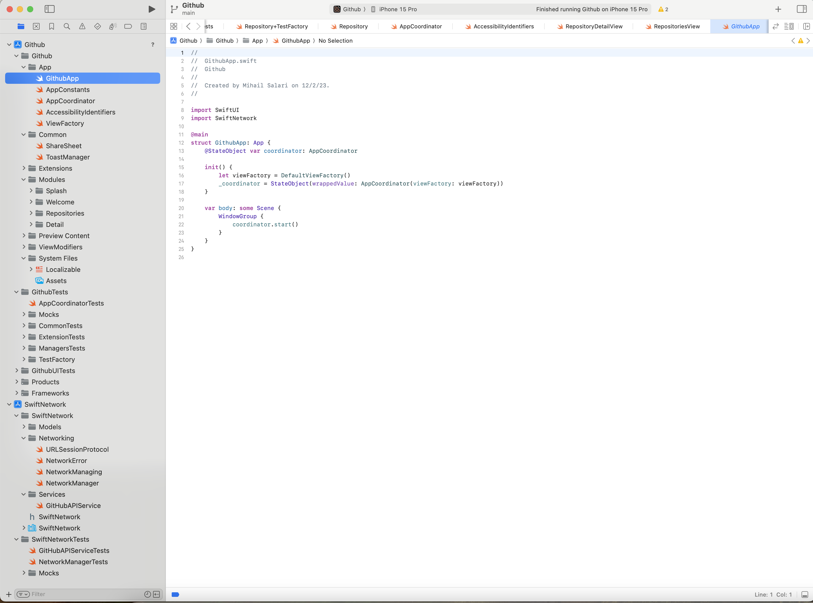

# Xapo iOS Project

## Description

Xapo is an iOS application designed to showcase trending projects from GitHub. The app lists these projects, allowing users to tap on them to view more detailed information. The project follows a clean and intuitive design, inspired by Apple's design guidelines and the aesthetic of the App Store app.

[//]: # (Link to Figma designs)
[Figma link](https://www.figma.com/file/5JrLNhD1etjj9FIfmpwe93/Untitled?node-id=0%3A1)

## Demo

### Screenshot

### Video

## Features

- **Trending Repositories:** Displays a list of trending GitHub repositories.
- **Detailed View:** Users can tap on any repository to see more details.
- **Elegant UI:** Designed with a focus on simplicity and usability, following Apple's guidelines.
- **Multi-language Support:** Fully localized in English, Romanian, and Spanish.
- **Responsive Layout:** Compatible with all iOS 15 supported devices.

## Technical Highlights

- **Swift Implementation:** Entirely written in Swift, showcasing advanced language features.
- **SwiftUI and Animations:** Leverages SwiftUI for UI components, with subtle animations enhancing the user experience.
- **Architecture:** Utilizes the MVVM+Coordinator pattern for clean separation of concerns and easier navigation management. Also view factory.
- **Modular Networking:** Features a custom framework for networking, ensuring modularity and reusability.
- **No Third-Party Dependencies:** All functionalities are implemented natively without relying on external libraries.
- **Testing:** Includes unit tests, UI tests, and snapshot tests to ensure code quality and reliability.
- **Error Handling:** Robust error handling with a toast manager for displaying user-friendly error messages.
- **Image Caching:** 
- **Pull to refresh:**

## Getting Started

To run the Xapo iOS app:

1. Clone the repository.
2. Open the Github.xcworkspace in Xcode.
3. Select a target device or simulator.
4. Run the project (CMD+R).

## Contribution

Feel free to contribute to the project by submitting pull requests or raising issues.

## Contact

For any queries or suggestions, please contact [info@mihailsalari.com].
Author - Mihail Salari.
